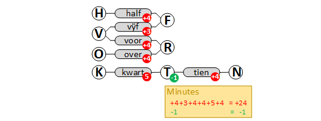
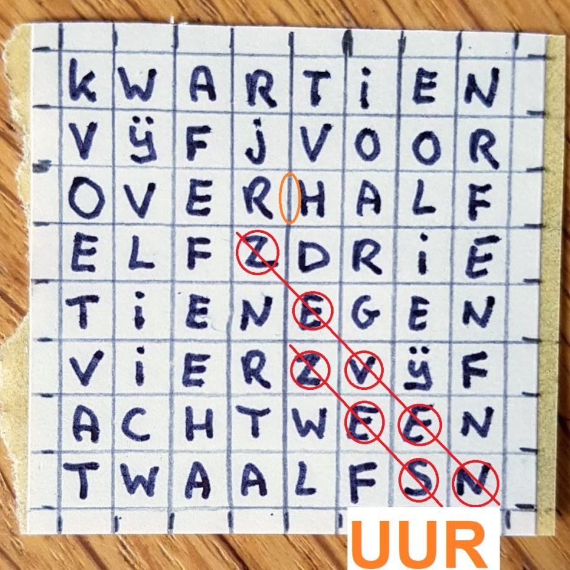
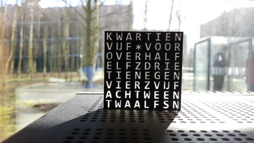
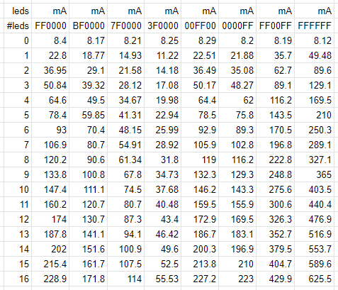
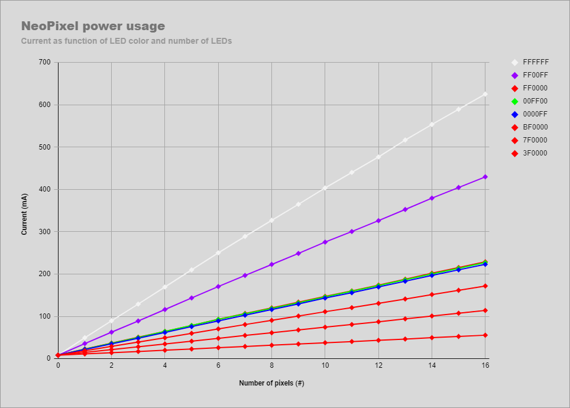

# WordClock
A clock that tells time in plain text.

Here is an example of a commercial [product](https://qlocktwo.com/).

## Introduction
I got the idea from [here](http://www.espruino.com/Tiny+Word+Clock).
It uses a simple 8x8 LED matrix, so very little mechanics to do.
The downside is that 8x8 LEDs means we are very restricted on the _model_: 
which words are placed where and how.

## Models
I want a Dutch word clock.
I do not like vertical text. Is it possible to fit all this on 8x8?

For the hours, we need words `one` to `twelve`. That is 48 characters - note we are writing `vijf`, not `vijf`.
This means that we can not have words for all 60 minutes. Let's try to go for multiples of 5 only.
In Dutch this means `vijf` (`over`), `tien` (over), `kwart` (over), tien (voor `half`), vijf (voor half), half, vijf (`over` half), etc.
That is 24 characters.

Oops, 24+48 is 72, and we only have 64. 
But we can save a bit, for example, for `tien` and `negen`, we only need `tienegen`.

### Model 1
For my first model, I made a graph, coupling first letters to last letters of words. I started with the minutes:



We can only save 1 character, but that doesn't help, we go from 24 to 23. But 24 is 3 rows, and saving one character 
on the last row doesn't help, we can not fit an hour there.

Two solutions are shown below. They fit in three rows.
```
  vijfkwart     kwartien
  tienvoor     vijf_voor
  overhalf     overhalf
```

Note that `vijf`, `tien`, and `kwart` need to come before `over` and `voor`, and only then we can have `half`.
So there is not much room for alternatives.

Let's next look at the hours. They need to come after the minutes.
This is the graph.


We have a problem. Full words require 48 characters. We can, at best, save 5, which still requires 43. 
But we only have 40 (5 rows of 8), so we need to get rid of 3 more characters.

I cheated in my first model: two paired letters vIEr and twaaLF, and one split word Z-E-S. 
There are also some minor problem: two times a space missing (between `tien` and `voor`, and between `over` and `half`) 
and the word `uur` missing (for every full hour).

This is my first attempt.


### Model 2.
Marc relaxed the rules, he allows diagonal words. He wrote a solver algorithm and found the below solution.



This eliminates the paired letters and split words. Still a missing space, and still `uur` missing.


## Prototype 1
First prototype was made with an ESP8266, and an 8x8 LED matrix.
I made a [video](https://www.youtube.com/watch?v=YDhCZarNm9g) that runs 
at approximately 600x so that all states appear in a one minute movie.

I also made a [real clock](WordClock) and a
[video](https://youtu.be/wVqeRSxwd_Y) that captures one state change.
This really keeps the time (based on the ESP8266 crystal).
At startup the user can press the FLASH button to set the hour and minute.

Next, I used model 2 (Marc's).
At startup you can not only set hour and minute, but also mode: clock or a fast demo.
Here is the [video](https://www.youtube.com/watch?v=LO9IB6KRluM) of the fast mode.


## Prototype 2
Many have made a wordclock, but assembling LEDs yourself is quite some [work](https://www.instructables.com/id/My-Arduino-WordClock/).
The good thing of the [8x8 LED matrix](https://www.aliexpress.com/item/32681183937.html) is that hardly any mechanics are needed. 
The downside, is that the 8x8 matrix is small, in my case 32x32 mm².

### 3D print

The I remembered that there are also [8x8 NeoPixel boards](https://www.aliexpress.com/item/32671025605.html).
Twice as big (65x65 mm²), fully assembled and still affordable.
On top of that: RGB and only a single wire to control all.

This NeoPixel matrix is hopefully big enough to allow the clock to be 3D printed.
I used a printer with two heads. The first head prints the black encasing, the second head prints a 
transparant diffuser. This is the [model](https://a360.co/2R9Nksa).

I was quite pleased with the result. The print resolution is sufficient to print the letters. 
And the transparancy is enough to see through.



I did not yet receice the NeoPixel matrix from AliExpress, so I had to guess where to leave a notch for the resistors.


### NeoPixel power

One thing that worries me about the NeoPixels is power usage. I tasked myself with measuring it.

It is helpfull to understand the inner workings of a NeoPixels.
It contains a controller and three LEDs.


I did have a 4x4 NeoPixel board, and I investigated the power usage on that board.
I measured the current when 1 NeoPixel is red (0xFF0000). I measured also for 2, 3, ... 16 NeoPixels.
I measured the current when 1 NeoPixel is red but dimmed a bit (0xBF0000), and also for 2, 3, ... 16 NeoPixels.
I measured the red at half brightness (0x7F0000) and at quarter brightness (0x3F0000), for 1 to 16 NeoPixels.
All these experiments use just the red LED in the NeoPixel, so for the next two experiments I used the other
two LEDs in the NeoPixels: green (0x00FF00) and blue (0x0000FF) for 1 to 16 NeoPixels.
Finally I measured when more than 1 LED is on: purple (0xFF00FF) and white (0xFFFFFF).

All in all, 8 experiments, each with 1 to 16 NeoPixels:



and here is the usage graphed:



Conclusions: 
 - There is a off current of 8 mA (0.5mA per NeoPixel), probably due to the controllers in the 16 NeoPixels
 - A NeoPixel LED consumes 13mA when fully powered (0xFF).
 - The power usage of a NeoPixel LED is linear in the control value (00..FF).
 - The power usage of a NeoPixel sequence is linear in the number of NeoPixels switched on.
 - A 4x4 at full white (0xFFFFFF) thus consumes 16x3x13 = 624 mA
 - A 8x8 at full white will likely consume 2496 mA or 2.5 A.

### Testing
Finally, I received the NeoPixels matrix.


Unfortunately, the resistors are not centered, so the 3D print does not fit well.


I adapted the software and did a try-out. Here is the [video](https://youtu.be/TlJQuVb-GIA)


