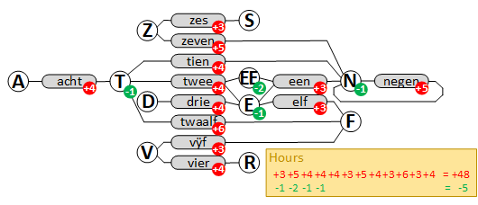
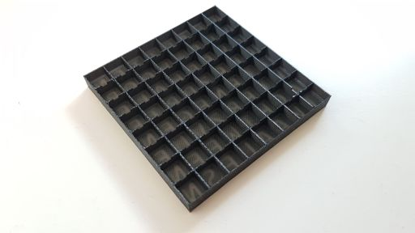
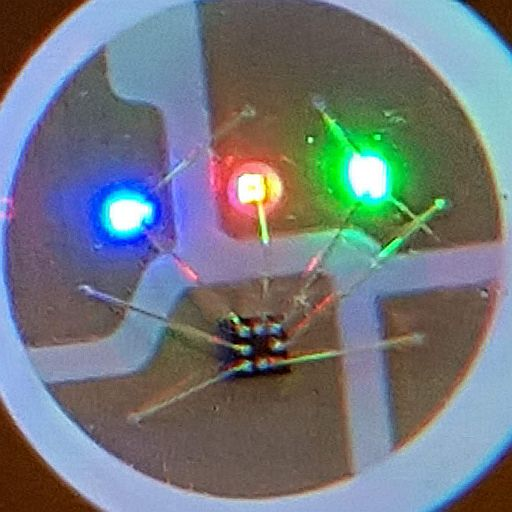
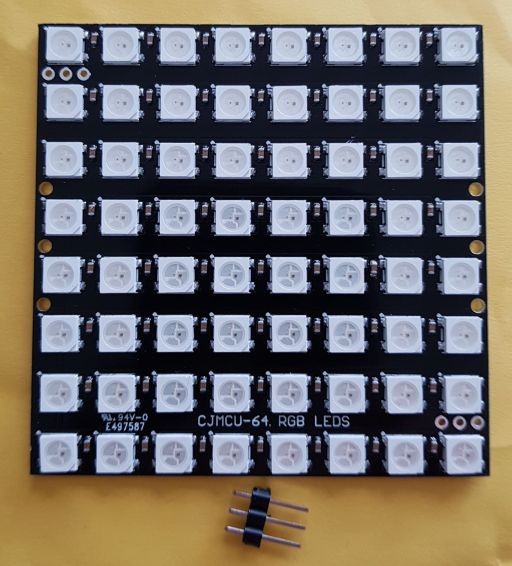

# WordClock
A clock that tells time in plain text.

Here is an example of a commercial [product](https://qlocktwo.com/).


## Introduction

I had seen WordClocks before, e.g. [here](https://www.instructables.com/id/My-Arduino-WordClock/).
However, doing the mechanics for 100 LEDs, isolating them (light bleed), wiring them - too much work.

Then I stumbled on a simpler [version](http://www.espruino.com/Tiny+Word+Clock).
It uses an 8x8 LED matrix, so very little mechanics to do.
The downside is that 8x8 LEDs means we are very restricted on the _model_: 
which words are placed where and how.


## Prototype 1

I want a Dutch word clock.
I do not like vertical text. Is it possible to fit all this on 8x8?

For the hours, we need words `one` to `twelve`. That is 48 characters - note we are writing `vijf`, not `vijf`.
This means that we can not have words for all 60 minutes. Let's try to go for multiples of 5 only.
In Dutch this means `vijf` (`over`), `tien` (over), `kwart` (over), tien (voor `half`), vijf (voor half), half, vijf (`over` half), etc.
That is 24 characters.

Oops, 24+48 is 72, and we only have 64. 
But we can save a bit, for example, for `tien` and `negen`, we only need `tienegen`.

For my first prototype, I made a graph, coupling first letters to last letters of words. I started with the minutes:


We can only save 1 character, but that doesn't help, we go from 24 to 23. But 24 is 3 rows, and saving one character 
on the last row doesn't help, we can not fit an hour there.

Two solutions are shown below. They fit in three rows.
```
  vijfkwart     kwartien
  tienvoor     vijf_voor
  overhalf     overhalf
```

Note that `vijf`, `tien`, and `kwart` need to come before `over` and `voor`, and only then we can have `half`.
So there is not much room for alternatives.

Let's next look at the hours. They need to come after the minutes.
This is the graph.



We have a problem. Full words require 48 characters. We can, at best, save 5, which still requires 43. 
But we only have 40 (5 rows of 8), so we need to get rid of 3 more characters.

I cheated in my first prototype: two paired letters vIEr and twaaLF, and one split word Z-E-S. 
There are also some minor problem: two times a space missing (between `tien` and `voor`, and between `over` and `half`) 
and the word `uur` missing (for every full hour).

This is my first attempt.


The first prototype was made with an ESP8266, and an 8x8 LED matrix.
I made a [video](https://www.youtube.com/watch?v=YDhCZarNm9g) that runs 
at approximately 600x so that all states appear in a one minute movie.

I also made a [real clock](WordClockLed) and a
[video](https://youtu.be/wVqeRSxwd_Y) that captures one state change.
This really keeps the time (based on the ESP8266 crystal).
At startup the user can press the FLASH button to set the hour and minute.


## Prototype 2

Marc relaxed the rules, he allows diagonal words. He wrote a solver algorithm and found the below solution.


This eliminates the paired letters and split words. Still a missing space, and still `uur` missing.

My next prototype uses Marc's model. It is supported by the same [sketch](WordClockLed) as the first prototype.

At startup you can not only set hour and minute, but also mode: clock or a fast demo.
Here is the [video](https://www.youtube.com/watch?v=LO9IB6KRluM) of the fast mode.


## 3D printing

The good thing of the [8x8 LED matrix](https://www.aliexpress.com/item/32681183937.html) is that hardly any mechanics are needed. 
The downside of the 8x8 LED matrix, is that the 8x8 matrix is small, in my case 32x32 mm².

However, there are also [8x8 NeoPixel boards](https://www.aliexpress.com/item/32671025605.html).
Twice as big (65x65 mm²), fully assembled and still affordable.
On top of that: the LEDs are full RGB and only a single wire to control all LEDs.

This NeoPixel matrix is big enough to allow the clock to be 3D printed.
I used a printer with two heads. The first head prints the black encasing, the second head prints a 
transparent diffuser. This is the [model](https://a360.co/2R9Nksa).

I was quite pleased with the result. The print resolution is sufficient to print the letters. 
And the transparency is enough to see through.


I did not yet receive the NeoPixel matrix from AliExpress, so I had to guess where to leave a notch for the resistors.




## NeoPixel power

One thing that worries me about the NeoPixels is power usage. I tasked myself with measuring it.

It is helpful to understand the inner workings of a NeoPixels.
It contains a controller and three LEDs.



I did have a 4x4 NeoPixel board, and I investigated the power usage on that board.
I measured the current when 1 NeoPixel is red (0xFF0000). I measured also for 2, 3, ... 16 NeoPixels.
I measured the current when 1 NeoPixel is red but dimmed a bit (0xBF0000), and also for 2, 3, ... 16 NeoPixels.
I measured the red at half brightness (0x7F0000) and at quarter brightness (0x3F0000), for 1 to 16 NeoPixels.
All these experiments use just the red LED in the NeoPixel, so for the next two experiments I used the other
two LEDs in the NeoPixels: green (0x00FF00) and blue (0x0000FF) for 1 to 16 NeoPixels.
Finally I measured when more than 1 LED is on: purple (0xFF00FF) and white (0xFFFFFF).

All in all, 8 experiments, each with 1 to 16 NeoPixels.
The [script](NeoPixelAmps) was short, but doing all the measurements took quite some time.
I manually logged all [results](NeoPixelAmps/NeoStats.txt), and then tabulated them in Excel:


Here is the usage graphed:


Conclusions: 
 - There is a off current of 8 mA (0.5mA per NeoPixel), probably due to the controllers in the 16 NeoPixels
 - A NeoPixel LED consumes 13mA when fully powered (0xFF).
 - The power usage of a NeoPixel LED is linear in the control value (00..FF).
 - The power usage of a NeoPixel sequence is linear in the number of NeoPixels switched on.
 - A 4x4 at full white (0xFFFFFF) thus consumes 16x3x13 = 624 mA
 - A 8x8 at full white will likely consume 2496 mA or 2.5 A.


## Prototype 3

Finally, I received the NeoPixels matrix.



Unfortunately, the resistors are not centered, so the 3D print does not fit well.


So, I made a new [3D model](https://a360.co/2RQO6uB).

I adapted the [software](WordClockNeo) and did a try-out. 
Here is the [video](https://youtu.be/TlJQuVb-GIA).


## Keeping time

Now that the NeoPixel solution with 3D printed enclosure seems to work, we needed to tackle the next biggest problem.
Keeping track of time. There are several solutions

 - Hand set the time, and use the crystal.  
   Plus: No extra components needed.  
   Minus: Needs hand setting. Does not know about daylight saving time.
 - Use a [DS1307](https://www.aliexpress.com/item/32827794525.html) or [DS1302](https://www.aliexpress.com/item/32728498431.html) time tracking chip  
   Plus: Keeps time, even when not mains powered (small battery).  
   Minus: Needs hand setting once and does not know about daylight saving time.   
 - Use time stamp from webservers (e.g. HEAD of google.nl)  
   Plus: No extra components needed (assuming ESP8266), no hand setting needed.  
   Minus: Web servers publish UTC, not local time. So adaptations for time zone and DST needed.
 - Use NTP servers  
   Plus: Servers are made for it. No extra components needed (assuming ESP8266), no hand setting needed.  
   Minus: NTP servers publish UTC, not local time.

When I found out the ESP8266 `<time.h>` actually includes NTP
and that the implementation has a single string parameter to configure time zone as well as DST,
I decided to use the last solution.

It basically boils down to telling `<time.h>` which NTP servers to use and what the timezone and DST configuration is.
Actually up to three servers can be passed. The timezone and DST configuration is passed as the first parameter:

```
  configTime(TZ, SVR1, SVR2, SVR3);
```

The first parameter is a quite compact string. See below the string for Amsterdam.

```
  #define TZ "CET-1CEST,M3.5.0,M10.5.0/3" // Amsterdam
```

The (standard) timezone is known as CET, and you need to subtract 1 to get UTC.
The daylight saving is known as CEST, and since it is not explicitly included, it defaults to one top of the standard time.
After the comma we find the start moment of the daylight saving period: it starts at month 3 (March), week 5, on Sunday (day 0).
After the next comma, we find when daylight saving stops: at month 10 (October), week 5, day 0 (Sunday).
The start is at 02:00:00 (default), the stop is explicit at 03:00:00.

See the [source](TimeKeeping) for more details on this string.

Here is the output of the script
```
time-keeping - NTP with TZ and DST
Not yet synced - 1970-01-01 09:00:00 (dst=0)
Not yet synced - 1970-01-01 09:00:01 (dst=0)
Not yet synced - 1970-01-01 09:00:02 (dst=0)
Not yet synced - 1970-01-01 09:00:03 (dst=0)
SET
2020-02-17 12:43:48 (dst=0)
2020-02-17 12:43:49 (dst=0)
2020-02-17 12:43:50 (dst=0)
2020-02-17 12:43:51 (dst=0)
2020-02-17 12:43:52 (dst=0)
2020-02-17 12:43:53 (dst=0)
2020-02-17 12:43:54 (dst=0)
2020-02-17 12:43:55 (dst=0)
2020-02-17 12:43:56 (dst=0)
2020-02-17 12:43:57 (dst=0)
2020-02-17 12:43:58 (dst=0)
2020-02-17 12:43:59 (dst=0)
DEMO >>> WiFi off: time continues
2020-02-17 12:44:00 (dst=0)
2020-02-17 12:44:01 (dst=0)
2020-02-17 12:44:02 (dst=0)
2020-02-17 12:44:03 (dst=0)
2020-02-17 12:44:04 (dst=0)
DEMO >>> Clock reset: time continues from reset val
SET
Not yet synced - 2000-11-22 11:22:34 (dst=0)
Not yet synced - 2000-11-22 11:22:35 (dst=0)
Not yet synced - 2000-11-22 11:22:36 (dst=0)
Not yet synced - 2000-11-22 11:22:37 (dst=0)
Not yet synced - 2000-11-22 11:22:38 (dst=0)
DEMO >>> WiFo on: time syncs again
Not yet synced - 2000-11-22 11:22:39 (dst=0)
Not yet synced - 2000-11-22 11:22:40 (dst=0)
Not yet synced - 2000-11-22 11:22:41 (dst=0)
SET
2020-02-17 12:44:14 (dst=0)
2020-02-17 12:44:15 (dst=0)
2020-02-17 12:44:16 (dst=0)
2020-02-17 12:44:17 (dst=0)
... many lines deleted
2020-02-17 13:44:10 (dst=0)
2020-02-17 13:44:11 (dst=0)
2020-02-17 13:44:12 (dst=0)
2020-02-17 13:44:13 (dst=0)
SET
2020-02-17 13:44:15 (dst=0)
```


 - At first, the time is not yet set, so we get "random" value (probably the date/time corresponding with value 0).
   The script uses the heuristic that any time before 2020 means 'not synced'.
   Note that the time keeping (stepping a second every second) happens, even though the time has not yet been SET.
 - It takes 5 seconds before we receive the first message from one of the NTP server. 
 - At 2020-02-17 12:43:48, the NTP messages arrives (see the SET). The time is known.
   Since 17 Feb is before DST start "month 3 (March), week 5, on Sunday (day 0)", daylight saving is indeed off.
 - At around 12:44:00 the script executes a test: it switches off WiFi.
   The time is maintained by the CPU (probably: crystal, timer, interrupt).
   So even without network, time is kept.
 - At 12:44:05 a second test kicks in.
   The local clock is hand written to 2000-11-22 11:22:34.
   Note the SET popping up.
   Since there is no WiFi, that time is maintained.
 - At 12:44:10 WiFi is switched on (step 3 of the test). 
   Since there is not an immediate NTP message, the old hand-set time is still maintained.
 - At 2020-02-17 12:44:14 an NTP message is received.
   The clock is back to real time, and locally maintained.
 - Note that one hour later (2020-02-17 13:44:14) the system (asks for and) receives the next NTP message.
   See the SET. The local clock is synced.

